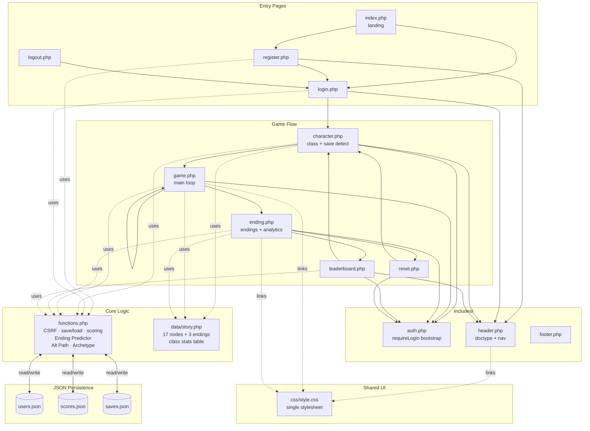

 grx# Shattered Crown — Architecture & Story Diagrams

Two Mermaid diagrams and a full narrative walkthrough of the project:

1. **Codebase Architecture** — how PHP files, shared includes, and JSON storage connect
2. **Story Graph** — how 17 gameplay nodes branch into 4 endings, including stat and item gates
3. **The Storyline** — act-by-act narrative, the three classes, key NPCs, and how each ending is earned

---

## The Storyline

### Premise

The kingdom of Valdris has fallen. King Aldric was slain in his own throne room, and the **Crown of Binding** — the artifact that anchored the kingdom's magic and held the eclipse at bay for three centuries — was shattered into three fragments during the assassination. Lord Malachar, the King's former spymaster, is responsible. He has claimed the obsidian throne and is hunting the shards so he can reforge the Crown under his own will.

The player wakes in a ruined temple with **14 days until the eclipse**. When the eclipse locks in, Malachar's binding becomes permanent and Valdris falls into eternal shadow. The hero must recover the three shards of the Crown of Binding before Malachar does — and then decide what to do with them.

### The Three Heroes

The opening scene is the same no matter which class you pick, but the way you *experience* every subsequent node is filtered through class-specific prose (the Dynamic Node Flavoring system). The three paths are mechanically distinct:

| Class | HP | STR | WIS | Combat Identity | Narrative Voice |
| ----- | -- | --- | --- | --------------- | --------------- |
| **Warrior** — The Forged Vanguard | 100 | 25 | 10 | Heavy armor, breaches gates, duels head-on | Military bearing; sees the world in terms of enemies, formations, weight of steel |
| **Mage** — The Void Weaver | 70 | 10 | 30 | Unravels wards, channels shards directly, counter-rituals | Arcane scholar; senses ley lines, recognizes binding magic, speaks in terms of resonance |
| **Rogue** — The Shadow Blade | 85 | 15 | 20 | Sneaks, times patrols, finds back routes, precise strikes | Pragmatic infiltrator; reads footprints, counts exits, distrusts everyone — especially Sable |

Each stat gate in the story favors one class naturally — a Warrior can force `str ≥ 25` gates that a Mage cannot, a Mage can dispel `wis ≥ 25` wards, a Rogue has middling stats but compensates with items and patience.

### Act 1 — The Awakening (nodes 01–03)

**node_01: The Ruined Temple.** The hero regains consciousness among crumbled pillars. A faint crimson glow pulses behind the broken altar — the first shard of the Crown. The player either **investigates the altar** (gaining the Ember Fragment and +1 alignment) or **leaves quickly for the crossroads** (−1 alignment, skipping the item).

**node_02: The First Shard.** If the altar was investigated, the shard is lifted free in a class-appropriate way (brute force, dispel thread, or a disarmed trap plate). A Mage or a wisdom-built Rogue can `wis ≥ 15` read the altar inscription — granting the Lost Litany Scroll and learning that "a king's final scream" is bleeding through the Crown's memory.

**node_03: The Crossroads.** Four roads meet beneath a dead oak. Three branches open the map:
- **North** toward Ember Keep (a besieged fortress holding the second shard)
- **East** into the Ice Caves (a frozen sanctum holding the second shard)
- **Wait** at the signpost (`wis ≥ 12`, meet Sable the Shadow Broker)

This is the first major branch. From here the story fans out across Act 2.

### Act 2 — The Two Shards (nodes 04–10)

**North Path — Ember Keep (node_04 → node_07 or node_08).** The Keep is under siege. Three ways in: **storm the gates** (`str ≥ 20`, costly in HP but trains strength), **sneak through a drainage tunnel** (grants the Rusted Key, used later at Malachar's gate), or **find the Broker's hidden route** (requires the Lost Litany Scroll from the temple, leads to a vault path that also grants a Vault Relic). All three converge on the throne room golem guarding **Crown Shard: Ember**.

**East Path — The Ice Caves (node_05 → node_09).** Frozen corpses, cryomantic seals. A Mage or wisdom-built Rogue can `wis ≥ 15` examine a body and recover the Cracked Signet Ring, hinting at Malachar's reach. Deeper in, the second shard (**Crown Shard: Frost**) is suspended in a pillar of ice. Three ways to free it: **shatter** (`str ≥ 18`), **dispel** (`wis ≥ 20`), or **channel** the Spell Crystal.

**Sable's Path — The Shadow Broker (node_06 → node_10).** The hidden third option. Sable has been following the hero since the temple. The player can **fight her** (`str ≥ 20`, +Shadow Cloak), **negotiate** (+Sable's Map, +wisdom), or **flee**. Whichever path, Sable reveals that **Malachar already has the third shard** and is performing the binding ritual inside his tower on the ridge. She is the story's best source of information, which is why she's the hidden-path character — the player has to pass a wisdom check at the crossroads even to notice she's there.

### Act 3 — The Ridge and the Tower (nodes 11–14)

**node_11: The Ridge Road.** With two shards in hand, the hero ascends toward Malachar's Tower. Three approaches: **the main road** (`str ≥ 20`, heavy guard), **scaling the eastern cliff** (risky, unguarded), or **Sable's Map** to a hidden entrance.

The main-road route leads to **node_12 (the front gate)**, where the player faces layered wards — military, arcane, and blood-magic. Force the gate (`str ≥ 25`), unravel the wards (`wis ≥ 25`), or slip in with the **Rusted Key** taken from the drainage tunnel in Act 2.

The cliff and map routes lead to **node_13 (the hidden entry)** — bypasses all exterior wards and offers a free detour to search the cellar for a Healing Draught.

**node_14: The Throne Room of Valdris.** All paths converge here. Malachar sits on the obsidian throne with the third shard fused to the crown on his head. The binding ritual is already in progress. The player has four options — and this is where the ending begins:

- **Challenge him directly** (`str ≥ 22`) → node_15, The Duel
- **Disrupt the binding ritual** (`wis ≥ 22`) → node_16, Ritual Collapse
- **Strike from the shadows** (requires **Shadow Cloak**) → node_17, The Silent Strike
- **Kneel and offer him the shards** → directly triggers the Tragic ending

All three confrontation paths (15/16/17) end with Malachar defeated and the Crown's three shards in the hero's hands — but the *choice of what to do next* is the real ending.

### The Four Endings

**The Shattered Crown Restored (`heroic`).** The player restores the Crown and places it on the empty throne, or shatters it so no one can use it. Selfless. The ley lines of Valdris sing for the first time in a generation and dawn returns. Alignment: +3.

**The Eclipse Descends (`tragic`).** The player either kneels to Malachar at node_14 or reaches the Throne Room without passing any confrontation gate. The binding completes. Valdris falls into permanent shadow. Alignment: −5.

**The New Tyrant (`secret`).** After defeating Malachar, the player takes the Crown for themselves. The eclipse breaks — but only because the hero *chose* to break it, and the kingdom now answers to a new tyrant wearing the victor's face. Alignment: −5.

**The Ashen Oath (`pyrrhic`).** The completionist ending, hidden behind an inventory triple-gate. The player must arrive at the final scene carrying **all three Crown Shards** — Ember, Frost, and Shadow — which means going out of their way through both Act 2 paths *and* unlocking the Shadow Cloak via Sable. With all three in hand, the player fuses them through their own body, reversing the binding through a living anchor. Malachar unravels. So does the hero — slowly, silently, locking their soul to the throne as its new warden. The kingdom is saved. The bards will sing the hero's name, and never speak it aloud. Alignment: +4.

**Fallen (`death`).** A failure state, not a narrative ending. If HP drops to 0 at any point, the hero dies mid-journey and the ending screen shows "Fallen in Valdris" — routed via `ending.php?reason=death`.

### Persona and Archetype

Across the run, every choice shifts the hero's **alignment score** between roughly −15 and +15. The final alignment maps to a **Legacy Persona** shown on the ending screen:

- **The Justiciar** (align ≥ 8) — a hero whose choices rang true, whose name is written in gold
- **The Warden** (align ≥ 3) — a protector who usually chose mercy and structure
- **The Drifter** (align −3…+3) — ambiguous, pragmatic, morally neutral
- **The Schemer** (align ≤ −3) — self-interested but not yet cruel
- **The Usurper** (align ≤ −8) — cruelty crystallized into policy

The **Archetype Match** score on the ending screen measures how well the player's persona matched the ending they reached. A Justiciar reaching the Heroic ending gets a 95%+ match. A Drifter who stumbles into the Pyrrhic ending gets a unique verdict: *"You walked every road this kingdom offered and paid the toll with your own life. The bards will sing your name — and never speak it aloud."*

---

## 1. Codebase Architecture

**Reading the architecture graph:**

- **Solid arrows** are navigation (redirects or links) — how the player moves between pages.
- **Dotted arrows** (`-.uses.->`) are `require_once` dependencies — where a page pulls in shared logic.
- Every authenticated page funnels through `includes/auth.php`, which calls `session_start()` and `requireLogin()`.
- Only `functions.php` touches JSON storage; pages never `file_get_contents` directly, so persistence is centralized.
- `data/story.php` is pure data (nested arrays) — no side effects, no I/O — which makes the story tree easy to reason about and modify.

---

## 2. Story Graph — Nodes & Endings

```mermaid
flowchart LR
    N1([node_01<br/>Ruined Temple])
    N2([node_02<br/>First Shard])
    N3{node_03<br/>Crossroads}
    N4([node_04<br/>Ember Gates])
    N5([node_05<br/>Ice Caves])
    N6([node_06<br/>Sable Broker])
    N7([node_07<br/>Inside Keep])
    N8([node_08<br/>Broker Passage])
    N9([node_09<br/>Frozen Sanctum])
    N10([node_10<br/>Sable Revelation])
    N11{node_11<br/>Ridge Road}
    N12([node_12<br/>Tower Front Gate])
    N13([node_13<br/>Tower Hidden Entry])
    N14{node_14<br/>Throne Room}
    N15([node_15<br/>The Duel])
    N16([node_16<br/>Ritual Collapse])
    N17([node_17<br/>Silent Strike])

    EH([ Heroic Victory<br/>Crown Restored ])
    ET([ Tragic Failure<br/>Eclipse Descends ])
    ES([ Secret Path<br/>New Tyrant ])
    EP([ Pyrrhic Sacrifice<br/>The Ashen Oath ])

    N1 --> N2
    N1 --> N3
    N2 -->|wis ≥ 15| N3
    N2 --> N3

    N3 --> N4
    N3 --> N5
    N3 -->|wis ≥ 12| N6

    N4 -->|str ≥ 20| N7
    N4 --> N7
    N4 -->|Lost Litany| N8

    N5 --> N9
    N5 -->|wis ≥ 15| N9

    N6 -->|str ≥ 20| N10
    N6 --> N10
    N6 --> N4

    N7 --> N11
    N8 --> N11
    N9 --> N11
    N10 --> N4
    N10 --> N12

    N11 -->|str ≥ 20| N12
    N11 --> N13
    N11 -->|Sable's Map| N13

    N12 -->|str ≥ 25| N14
    N12 -->|wis ≥ 25| N14
    N12 -->|Rusted Key| N14
    N13 --> N14

    N14 -->|str ≥ 22| N15
    N14 -->|wis ≥ 22| N16
    N14 -->|Shadow Cloak| N17
    N14 ==>|no gate passed| ET

    N15 --> EH
    N15 --> ES
    N15 -->|all 3 shards| EP
    N16 --> EH
    N16 --> ES
    N16 -->|all 3 shards| EP
    N17 --> EH
    N17 --> ES
    N17 -->|all 3 shards| EP

    classDef ending fill:#2a1510,stroke:#cfa857,color:#f5e6c7,stroke-width:2px
    classDef gate fill:#1a2030,stroke:#8fb4ff,color:#e0e8ff
    class EH,ET,ES,EP ending
    class N3,N11,N14 gate
```

**Reading the story graph:**

- **Rectangles** are linear story beats.
- **Diamonds** (`node_03`, `node_11`, `node_14`) are major branch points where multiple gated options diverge.
- **Labeled edges** are gated — `str ≥ 20` requires a Strength check, `wis ≥ 15` requires Wisdom, `item:Lost Litany` requires an inventory item.
- **Unlabeled edges** are always available.
- Every path funnels through `node_14` (the Throne Room) — the confrontation style decides which ending scene triggers.
- The **Tragic** ending is the default if no gate at `node_14` is passed — representing the hero reaching Malachar unprepared.
- **Heroic vs Secret** at `node_15`/`node_16`/`node_17` is decided by the final alignment-weighted choice in each resolution scene.

---

## Ending Triggers Summary

| Ending | Node | Typical Path | Alignment Tendency |
| ------ | ---- | ------------ | ------------------ |
| Heroic Victory | `node_ending_heroic` | Confront Malachar with a resolved stat/item path, then choose the selfless resolution | Positive (Justiciar / Warden) |
| Tragic Failure | `node_ending_tragic` | Reach Throne Room without meeting any confrontation gate | Often near zero (underprepared Drifter) |
| Secret Path | `node_ending_secret` | Confront Malachar successfully, then choose the self-serving resolution | Negative (Schemer / Usurper) |
| Pyrrhic Sacrifice | `node_ending_pyrrhic` | Carry all three Crown Shards (Ember + Frost + Shadow) into the final scene and fuse them through your own body | Strongly positive — a selfless ending only reachable by a completionist run |
| Fallen (Death) | — | HP drops to 0 mid-journey; routed via `ending.php?reason=death` | Any |